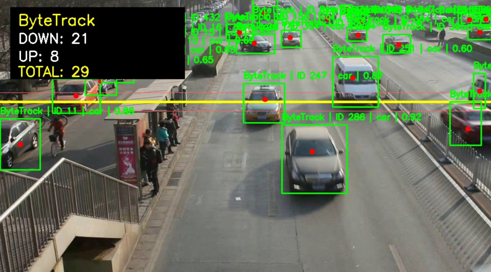

# 🚗 traffic-vehicle-counting-yolo-tracking

> Vehicle detection, multi-object tracking, and line-crossing counting using YOLO11, ByteTrack, and BoT-SORT on real-world traffic camera footage.

---

## 📌 Overview

This project implements an end-to-end computer vision pipeline for **vehicle detection, tracking, and counting** on traffic surveillance footage from the [UA-DETRAC](https://detrac-db.rit.albany.edu/) dataset.

The pipeline converts raw image sequences into video, runs YOLO11-based vehicle detection, applies multi-object tracking (MOT) using two different trackers — **ByteTrack** and **BoT-SORT** — and counts vehicles that cross a predefined horizontal counting line. Both trackers are evaluated side-by-side using tracking stability and counting metrics.

This is an experimental computer vision pipeline. Results depend on video quality, camera angle, detector confidence thresholds, and tracker configuration.

---

## 🖼️ Preview



---

## ✨ Key Features

- **Image sequence → video conversion** from UA-DETRAC frame folders
- **YOLO11s-based vehicle detection** (car, bus, truck, motorcycle)
- **Multi-object tracking** with ByteTrack and BoT-SORT
- **Line-crossing vehicle counting** (directional: UP / DOWN)
- **Duplicate counting prevention** — each track ID is counted only once
- **Track stability filtering** — new tracks are ignored for the first 5 frames to reduce noise
- **Smoothed center point tracking** using a rolling average over recent positions
- **Side-by-side tracker comparison** with quantitative metrics
- **Annotated output video** with bounding boxes, track IDs, class labels, confidence scores, center points, and a live counting panel

---

## 🛠️ Technologies Used

| Component | Library / Tool |
|-----------|---------------|
| Object Detection | [Ultralytics YOLO11](https://github.com/ultralytics/ultralytics) (`yolo11s.pt`) |
| Multi-Object Tracking | ByteTrack, BoT-SORT (via Ultralytics) |
| Video I/O | OpenCV (`cv2`) |
| Data Analysis | pandas |
| Dataset Access | Kaggle API |
| Runtime | Google Colab / Python 3 |

---

## 📦 Dataset

**UA-DETRAC** (University at Albany Detection and Tracking)

- Real-world traffic surveillance video captured from fixed overhead cameras
- Contains 100 video sequences recorded at 25 fps
- Covers various traffic conditions: day/night, occlusion, different vehicle densities
- Dataset downloaded via Kaggle: [`bratjay/ua-detrac-orig`](https://www.kaggle.com/datasets/bratjay/ua-detrac-orig)

The dataset is provided as image sequences (folders of JPEG frames). This project converts them into video format prior to tracking.

---

## 🔄 Project Pipeline

```
UA-DETRAC Image Sequences
         │
         ▼
 Convert to Video (OpenCV VideoWriter, 25 fps, up to 1000 frames)
         │
         ▼
 YOLO11s Vehicle Detection (car, bus, truck, motorcycle)
         │
         ▼
 Multi-Object Tracking (ByteTrack / BoT-SORT)
         │
         ▼
 Track Filtering (min age = 5 frames, rolling center smoothing)
         │
         ▼
 Line-Crossing Detection (horizontal counting line at 38% of frame height)
         │
         ▼
 Directional Vehicle Count (UP / DOWN, each ID counted once)
         │
         ▼
 Annotated Output Video + Metrics DataFrame
```

---

## 🔍 How It Works

### Detection
YOLO11s processes each video frame independently and returns bounding boxes, class labels, and confidence scores for detected vehicles (car, bus, truck, motorcycle).

### Tracking
The tracker (ByteTrack or BoT-SORT) assigns consistent track IDs across frames by associating detections using IoU and appearance features. This allows each vehicle to be followed as it moves through the scene.

### Counting
A horizontal counting line is drawn across the frame at a configurable height (`line_ratio`). Each tracked vehicle's center point is computed as a rolling average over its last 5 positions for stability. When a vehicle's smoothed center transitions from one side of the line to the other (UP → DOWN or DOWN → UP), it is counted — **once per track ID only**.

A neutral margin zone around the line prevents jittery detections near the line boundary from triggering false counts.

### Common Tracking Challenges
Real-world traffic video introduces several well-known multi-object tracking difficulties:

- **ID switches** — a vehicle's track ID changes mid-sequence due to occlusion or low confidence
- **Short-lived tracks** — spurious detections that appear for only a few frames
- **Missed detections** — YOLO fails to detect a vehicle in some frames (motion blur, occlusion)
- **Perspective distortion** — overhead camera geometry causes bounding box size to vary with distance
- **Overlapping vehicles** — closely spaced vehicles may merge into a single detection

These issues are partially mitigated through track age filtering and center point smoothing, but cannot be fully eliminated without more advanced re-identification methods.

---

## ⚔️ Tracker Comparison: ByteTrack vs BoT-SORT

| Tracker | Down | Up | Total | Unique Track IDs | Short Tracks (<10 frames) | Avg Track Length | FPS |
|---------|------|----|-------|------------------|--------------------------|------------------|-----|
| ByteTrack | 25 | 9 | 34 | 119 | 40 | 127.06 | 1.9 |
| BoT-SORT | 25 | 9 | 34 | 115 | 37 | 130.99 | 1.9 |

### Interpretation

Both trackers produced an identical final vehicle count of **34** on this sequence, demonstrating that the counting pipeline is robust to tracker choice under these conditions.

However, BoT-SORT showed slightly better **tracking stability**:
- Fewer unique track IDs (115 vs 119) → fewer ID switches or fragmented trajectories
- Fewer short-lived tracks (37 vs 40) → less noise from spurious detections
- Higher average track length (130.99 vs 127.06 frames) → vehicles were followed more consistently

**Conclusion:** BoT-SORT can be considered marginally more stable on this sequence, though the counting result was identical. For longer sequences or denser traffic, the stability difference may have a greater impact on counting accuracy.

---

## 🚀 How to Run

### 1. Clone the repository

```bash
git clone https://github.com/your-username/traffic-vehicle-counting-yolo-tracking.git
cd traffic-vehicle-counting-yolo-tracking
```

### 2. Install dependencies

```bash
pip install ultralytics opencv-python kaggle pandas
```

### 3. Set up Kaggle credentials

```python
import os
os.environ['KAGGLE_USERNAME'] = 'your_kaggle_username'
os.environ['KAGGLE_KEY'] = 'your_kaggle_api_key'
```

Or place `kaggle.json` in `~/.kaggle/`.

### 4. Download the dataset

```bash
kaggle datasets download -d bratjay/ua-detrac-orig -p ./datasets/ua_detrac --unzip
```

### 5. Run the notebook

Open and run `vehicle_counting.ipynb` in Google Colab or locally step by step:

- Convert image sequence → video
- Run ByteTrack counting
- Run BoT-SORT counting
- Compare metrics

---

## 📁 Project Structure

```
traffic-vehicle-counting-yolo-tracking/
│
├── assets/
│   └── counter.png                  # Preview screenshot
│
├── outputs/
│   └── *.mp4                        # Output annotated videos (generated at runtime)
│
├── bytetrack_custom.yaml            # Custom ByteTrack configuration
├── vehicle_counting.ipynb           # Main project notebook
└── README.md
```

> **Output videos** are generated at runtime and saved to the `outputs/` folder. Open them with any video player (VLC, QuickTime, etc.) to review bounding boxes, track IDs, center points, and the live counting panel.

---

## 🎬 Example Output

Each output video frame contains:

- **Green bounding boxes** around detected vehicles
- **Track ID** and class label (car / bus / truck / motorcycle) above each box
- **Red center point dot** showing the smoothed trajectory position
- **Yellow counting line** across the frame
- **Blue margin lines** defining the neutral zone around the counting boundary
- **Top-left panel** showing the tracker name, DOWN count, UP count, and TOTAL count in real time

---

## 🔧 Possible Improvements

- **Re-identification (ReID)** features for more robust tracking across occlusions
- **Multiple counting lines** or polygonal ROIs for intersection-level analysis
- **Per-class counting** (count cars, buses, trucks separately)
- **Higher-resolution input** or a larger YOLO model (e.g., `yolo11m.pt`) for better detection accuracy
- **GPU acceleration** to significantly improve processing FPS
- **Kalman filter tuning** per camera angle and traffic density
- **Evaluation against ground truth annotations** (UA-DETRAC provides MOT-format labels)
- **Bi-directional lane separation** using left/right lane masks

---

## 📝 Conclusion

This project demonstrates a complete, modular computer vision pipeline for traffic monitoring — from raw image sequences to tracked, counted, and annotated output video. It validates that both ByteTrack and BoT-SORT can produce reliable vehicle counts on a standard traffic surveillance benchmark, with BoT-SORT offering marginal tracking stability improvements.

As an experimental pipeline, performance is sensitive to detector confidence thresholds, camera perspective, lighting conditions, and tracker hyperparameters. The methodology provides a solid foundation for more advanced traffic analysis applications such as intersection throughput measurement, congestion detection, or real-time traffic monitoring systems.

---


Cəlal Ibrahimli

---

<p align="center">
  Built with YOLO11 · ByteTrack · BoT-SORT · OpenCV
</p>
